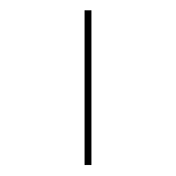
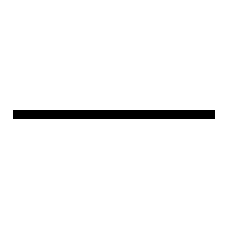
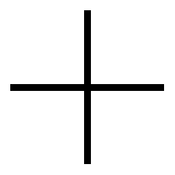
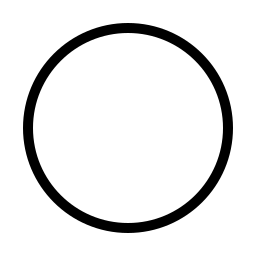
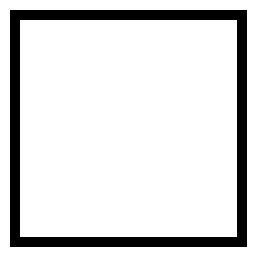

# CG‑studies‑py

Este repositório contém estudos e experimentos em **Computação Gráfica** e **manipulação de matrizes** em Python. Ele inclui uma atividade principal proposta, além de scripts auxiliares para gerar formas geométricas e trabalhar com matrizes usando **Cairo** e **NumPy**.

---

## Estrutura do projeto

```
CG‑studies‑py/
│
├── outputs/            # Diretório onde as imagens geradas pelo Cairo são salvas
├── .gitignore          # Arquivo de configuração do Git para ignorar arquivos/pastas
├── cairo_tests.py      # Script para desenhar linhas, formas e um emoji sorridente
├── matrix.py           # Script para operações básicas com matrizes usando NumPy
└── README.md           # Este arquivo
```

---

## Atividade principal

O projeto envolve a implementação de operações gráficas básicas e manipulação de matrizes em Python.
O objetivo é explorar conceitos de:

* **Computação gráfica** com a biblioteca Cairo
* **Operações matriciais** usando NumPy
* Geração de imagens e visualização de matrizes

---

## Scripts e funcionalidades

### **1. cairo\_tests.py**

Este script gera imagens com formas geométricas e um emoji sorridente usando a biblioteca **Cairo**. Todas as imagens são salvas no diretório `outputs/`.

A classe `Saidas` possui os seguintes métodos:

* **`vertical_line(file)`** → desenha uma linha vertical centralizada.
* **`horizontal_line(file)`** → desenha uma linha horizontal centralizada.
* **`cross_lines(file)`** → desenha duas linhas cruzadas no centro.
* **`circle(file)`** → desenha um círculo centralizado com raio de 100 pixels.
* **`square(file)`** → desenha um quadrado centralizado.
* **`smiling_face(file)`** → desenha um emoji sorridente com face, olhos e boca.

O bloco `main` chama todos os métodos e salva as imagens com nomes descritivos:
`vert_line.png`, `hori_line.png`, `cross_lines.png`, `circle.png`, `square.png`, `emoji.png`.

---

### **2. matrix.py**

Este script demonstra operações básicas com matrizes usando **NumPy**. A classe `Matrix` inclui:

* **`matrix_d1()`** → retorna uma matriz unidimensional (vetor) de tamanho 3 com valores aleatórios.
* **`matrix_d3()`** → retorna uma matriz 3x3 com valores aleatórios.
* **`identity(size=3)`** → retorna uma matriz identidade de tamanho 3x3.
* **`zeros(rows=3, col=3)`** → retorna uma matriz nula (todos elementos zero).
* **`opposite_matrix(matrix)`** → retorna a matriz oposta (elementos multiplicados por -1).

O bloco `main` demonstra o uso da classe, imprimindo os resultados de cada operação no console.

---

## Exemplos de imagens geradas

As imagens abaixo foram geradas pelo script `cairo_tests.py` e estão salvas na pasta `outputs/`:

**Linha vertical**



**Linha horizontal**



**Linhas cruzadas**



**Círculo**



**Quadrado**



**Emoji sorridente**


---

## Exemplos de saída do matrix.py

O script `matrix.py` demonstra operações básicas com matrizes usando **NumPy**. Abaixo estão alguns exemplos de saída que podem ser geradas ao executar o script:

**Matriz unidimensional (vetor 3 elementos)**

```
[0.472, 0.831, 0.295]
```

**Matriz 3x3 aleatória**

```
[[0.214, 0.658, 0.932],
 [0.123, 0.879, 0.447],
 [0.765, 0.302, 0.590]]
```

**Matriz identidade 3x3**

```
[[1. 0. 0.]
 [0. 1. 0.]
 [0. 0. 1.]]
```

**Matriz nula 3x3**

```
[[0. 0. 0.]
 [0. 0. 0.]
 [0. 0. 0.]]
```

**Matriz oposta da matriz 3x3 aleatória**

```
[[-0.214, -0.658, -0.932],
 [-0.123, -0.879, -0.447],
 [-0.765, -0.302, -0.590]]
```

> **Observação:** Os valores de matrizes aleatórias vão variar a cada execução, pois são gerados com `np.random.rand()`.

---

## Como usar

1. **Instalar dependências**:

```bash
pip install numpy pycairo
```

2. **Gerar imagens com Cairo**:

```bash
python cairo_tests.py
```

* As imagens serão salvas na pasta `outputs/`.

3. **Executar operações com matrizes**:

```bash
python matrix.py
```

* Os resultados serão impressos no console.

---

## Observações

* O diretório `outputs/` já contém as imagens geradas.
* Todas as imagens são salvas no formato PNG.
* Os exemplos de matrizes em `matrix.py` usam dimensões padrão, mas podem ser alteradas via parâmetros das funções.

Quer que eu faça isso também?
